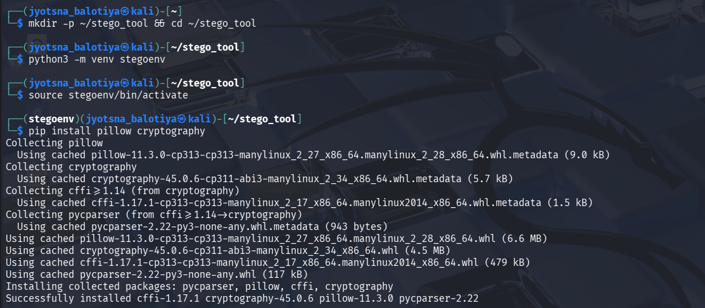
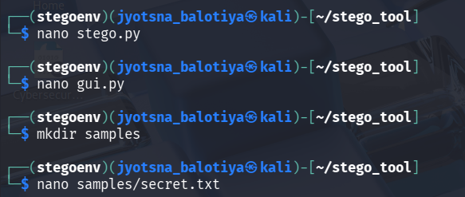
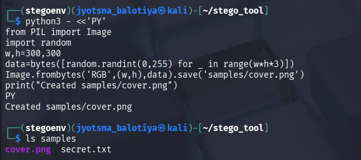
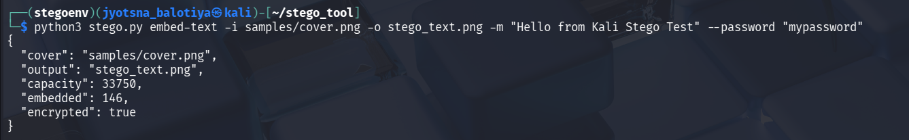
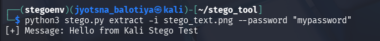
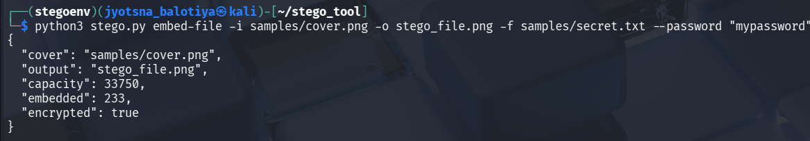
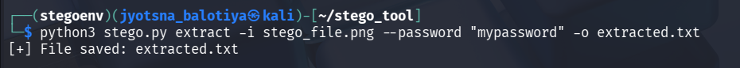
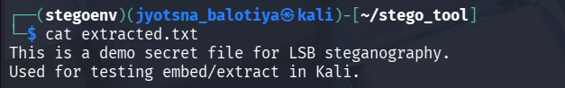

# Steganography-Tool-for-Image-File-Hiding

A Python-based **Steganography Tool** that allows you to **hide text messages or files inside an image** using the **LSB (Least Significant Bit) technique with password encryption**.  
This project was implemented and tested on **Kali Linux**.

---

##  Features
✔ Hide **text messages** inside an image  
✔ Hide **secret text files** like `secret.txt` inside an image (Hide **any file** such as text files (`.txt`), documents, or small data files inside an image)
✔ **Password-based encryption** for extra security  
✔ **Extract hidden data** back from the image  
✔ Simple CLI-based tool, lightweight, and easy to use  

---

##  Project Structure
```
stego_tool/
│
├── stego.py        # Main script for embedding & extracting
├── gui.py          # GUI (optional)
├── samples/        # Sample cover image & secret text
│   ├── cover.png
│   └── secret.txt
├── stego_text.png  # Output image after embedding text
├── stego_file.png  # Output image after embedding file
└── extracted.txt   # Extracted file after decoding
```

---

##  Setup & Installation

### **1. Create Virtual Environment**
```bash
mkdir -p ~/stego_tool && cd ~/stego_tool
python3 -m venv stegoenv
source stegoenv/bin/activate
```

### **2. Install Dependencies**
```bash
pip install pillow cryptography
```

---

##  Usage

### **1. Embed Text into Image**
```bash
python3 stego.py embed-text -i samples/cover.png -o stego_text.png -m "Hello from Kali Stego Test" --password "mypassword"
```

### **2. Extract Text from Image**
```bash
python3 stego.py extract -i stego_text.png --password "mypassword"
```

### **3. Embed File into Image**
```bash
python3 stego.py embed-file -i samples/cover.png -o stego_file.png -f samples/secret.txt --password "mypassword"
```

### **4. Extract File from Image**
```bash
python3 stego.py extract -i stego_file.png --password "mypassword" -o extracted.txt
```

---

##  Screenshots

###  **Step 1: Virtual Environment & Package Installation**


###  **Step 2: Creating Files and Directories**


###  **Step 3: Generating Cover Image**


###  **Step 4: Embedding Text into Image**


###  **Step 5: Extracting Text from Image**


###  **Step 6: Embedding File into Image**


###  **Step 7: Extracting File from Image**


###  **Step 8: Extracted File Content**


---

## 🔐 Why Steganography?
Steganography is the art of **hiding information inside other files** so that the presence of the data is concealed. Unlike encryption, which only hides the content, steganography hides the **existence** of the data itself.  
This technique is widely used in **cybersecurity, intelligence, and digital forensics** for secure data transmission.

---

##  Author
**Jyotsna Balotiya**  
GitHub: [@jyotsnabalotiya](https://github.com/jyotsnabalotiya)

---
 **If you like this project, give it a Star on GitHub!**
